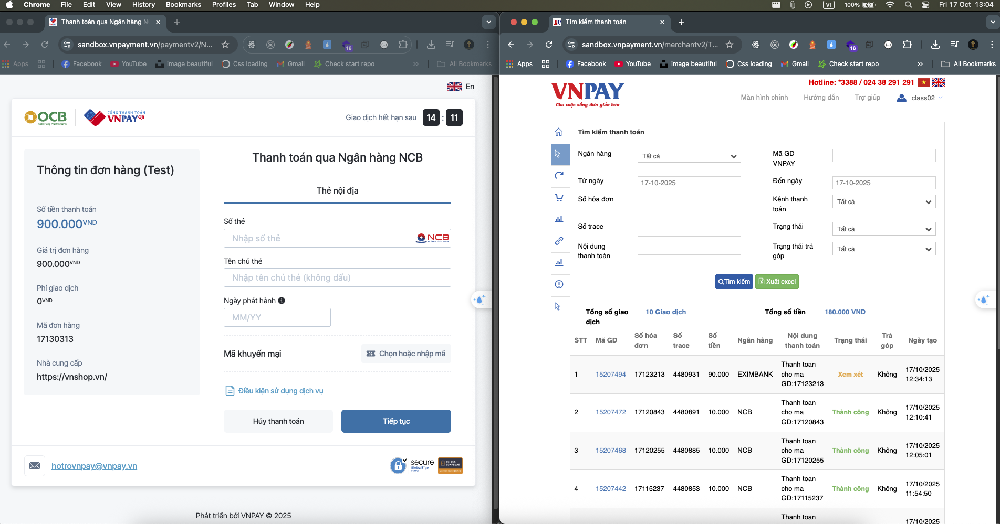

**# Hướng dẫn chạy demo thanh toán VNPay bằng NodeJS
**

## 0. Đây là sản phẩm 


## 1. Cài đặt NodeJS
Tải và cài đặt NodeJS tại: https://nodejs.org/en/

## 2. Mở Command Prompt (cmd) và chuyển tới thư mục code demo
Ví dụ:
cd vnpay_nodejs

## 3. Cài đặt module cần thiết
npm install

## 4. Cấu hình thông tin VNPay
Mở file: vnpay_nodejs/config/default.json  
Thay các giá trị sau bằng thông tin của bạn (do VNPay cung cấp):
- vnp_TmnCode
- vnp_HashSecret
- vnp_Url (URL thanh toán)
- vnp_Api (URL kiểm tra giao dịch)
- vnp_ReturnUrl (URL frontend nhận kết quả)
- vnp_IpnUrl (URL backend nhận IPN - thông báo server-to-server)

Nếu chưa có các thông tin này, vui lòng liên hệ với VNPay.

## 5. Chạy ứng dụng
npm start

Ứng dụng sẽ chạy mặc định ở port 8888 (hoặc theo cấu hình trong code).

## 6. Truy cập giao diện demo
Mở trình duyệt và truy cập:
http://localhost:8888/order/create_payment_url

Trang này sẽ tạo URL thanh toán và chuyển hướng sang VNPay.

## 7. Sau khi thanh toán
- VNPay sẽ redirect người dùng về `vnp_ReturnUrl` (frontend)
- VNPay sẽ gọi `vnp_IpnUrl` (backend) để xác nhận giao dịch (server-to-server, quan trọng để tránh giả mạo)

## 8. Tra cứu giao dịch trên dashboard VNPay
URL: https://sandbox.vnpayment.vn/merchantv2/Transaction/PaymentSearch.htm

## 9. Tạo tài khoản VNPay Sandbox
URL: https://sandbox.vnpayment.vn/devreg

## 10. Tài khoản test và tài liệu mẫu
URL: https://sandbox.vnpayment.vn/apis/vnpay-demo/

## 11. Tài liệu API chính thức
URL: https://sandbox.vnpayment.vn/apis/

## 12. Luồng đi 

```
Frontend (browser)
   |
   | 1) Tạo yêu cầu thanh toán (POST /order/create_payment_url)
   v
Backend (your server)
   - Sinh orderId (vnp_TxnRef) duy nhất, lưu DB (status = INIT)
   - Tạo vnp_Params + tính vnp_SecureHash (HMAC-SHA512)
   - Trả JSON { paymentUrl } cho frontend (AJAX)  OR redirect trực tiếp
   |
   | 2a) Frontend điều hướng người dùng -> paymentUrl (VNPAY)
   v
VNPAY (cổng thanh toán)
   - Người dùng thực hiện thanh toán trên giao diện VNPAY
   |
   | 3a) VNPAY redirect browser -> vnp_ReturnUrl (user-facing)
   v
Backend vnp_ReturnUrl (GET)
   - Nhận query params từ VNPAY (bao gồm vnp_SecureHash)
   - Xác minh chữ ký (recreate signData + HMAC)
   - Hiển thị trang kết quả cho user (không dùng làm nguồn truth)
   |
   | 3b) (Song song) VNPAY gọi IPN -> vnp_IpnUrl (server-to-server)
   v
Backend vnp_IpnUrl (GET/POST)
   - Xác minh chữ ký
   - Kiểm tra tồn tại order và amount
   - Cập nhật DB: status = SUCCESS / FAILED (idempotent)
   - Trả JSON { RspCode: "00", Message: "Success" } (nếu ok)
   |
   | 4) (Nếu cần) Backend gọi QueryDR để kiểm tra trực tiếp với VNPAY
   v
VNPAY API (merchant_webapi/api/transaction)
   - Trả thông tin chi tiết về giao dịch
   |
   | 5) (Nếu yêu cầu) Refund API gọi tới VNPAY để hoàn tiền
   v
VNPAY API (refund)
```
Giải thích

`Frontend → Backend (create_payment_url)`: frontend gửi số tiền + thông tin, backend tạo vnp_TxnRef, tính chữ ký, trả paymentUrl.

`Frontend điều hướng tới VNPAY`: user điền OTP / thẻ / chọn ngân hàng trên trang VNPAY.

`VNPAY → Return URL`: browser được redirect về vnp_ReturnUrl — chỉ để hiển thị kết quả cho user (không an toàn để tin tưởng duy nhất).

`VNPAY → IPN (server-to-server)`: VNPAY gọi vnp_IpnUrl công khai để thông báo trạng thái thực tế; backend phải trả {RspCode:"00"} để xác nhận.

`QueryDR`: khi cần kiểm tra chủ động (backup), backend gọi API querydr tới VNPAY để lấy trạng thái giao dịch.

`Refund`: nếu cần trả tiền, backend gọi API refund của VNPAY với chữ ký tương ứng.

---

# Ghi chú quan trọng

✅ `vnp_ReturnUrl`: nhận kết quả trên trình duyệt (dành cho user xem)  
✅ `vnp_IpnUrl`: bắt buộc! VNPay gửi thông báo server-to-server để xác nhận giao dịch chính xác  
✅ `vnp_TxnRef`: mã đơn hàng duy nhất của bạn, bạn tự truyền (sử dụng để mapping đơn hàng)  
✅ Nên lưu log toàn bộ query VNPay gửi về để kiểm tra sau này

---

# Cấu trúc luồng thanh toán

1. Frontend → gọi API backend tạo payment URL
2. Backend → tạo URL, ký params, trả về URL
3. Frontend → redirect user sang VNPay
4. User thanh toán xong tại VNPay
5. VNPay:
   - Gửi người dùng về `vnp_ReturnUrl`
   - Gửi IPN về `vnp_IpnUrl` (QUAN TRỌNG)
6. Backend xử lý IPN, xác nhận giao dịch “thành công” hoặc “thất bại”
7. Cập nhật đơn hàng trong database

---
## 📚 Dạy Học Online

Bên cạnh tài liệu miễn phí, mình còn mở các khóa học online:

- **Lập trình web cơ bản → nâng cao**
- **Ứng dụng về AI và Automation**
- **Kỹ năng phỏng vấn & xây CV IT**

### Thông Tin Đăng Ký

- 🌐 Website: [https://profile-forme.com](https://profile-forme.com)
- 📧 Email: nguyentientai10@gmail.com
- 📞 Zalo/Hotline: 0798805741

---

## 💖 Donate Ủng Hộ

Nếu bạn thấy các source hữu ích và muốn mình tiếp tục phát triển nội dung miễn phí, hãy ủng hộ mình bằng cách donate.  
Mình sẽ sử dụng kinh phí cho:

- 🌐 Server, domain, hosting
- 🛠️ Công cụ bản quyền (IDE, plugin…)
- 🎓 Học bổng, quà tặng cho cộng đồng

### QR Code Ngân Hàng

Quét QR để ủng hộ nhanh:


**QR Code ABBank**  
- Chủ tài khoản: Nguyễn Tiến Tài  
- Ngân hàng: NGAN HANG TMCP AN BINH  
- Số tài khoản: 1651002972052

---

## 📞 Liên Hệ

- 🎥 TikTok Source: [@hoclaptrinhvui](https://www.tiktok.com/@hoclaptrinhvui)
- 📚 Tiktok Dạy Học: [@code.web.khng.kh](https://www.tiktok.com/@code.web.khng.kh)
- 💻 GitHub: [fdhhhdjd](https://github.com/fdhhhdjd)
- 📧 Email: [nguyentientai10@gmail.com](mailto:nguyentientai10@gmail.com)

Cảm ơn bạn đã quan tâm & chúc bạn học tập hiệu quả! Have a nice day <3!!
